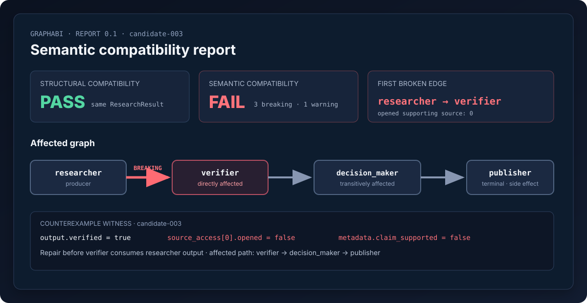

# GraphABI

Semantic compatibility testing for AI-agent graphs.

Your schemas can remain valid while the meaning between agents silently
breaks. GraphABI catches the first broken edge and shows everything
downstream that may be affected.

[](CHANGELOG.md)
[](.github/workflows/ci.yml)
[](pyproject.toml)
[](pyproject.toml)
[](LICENSE)



## The problem in 30 seconds

An upstream agent returns `verified=true`, `confidence=0.92`, and a list of sources. A Pydantic
model can prove those are a boolean, a bounded number, and strings. It cannot prove that
`verified` still means “a source was opened and checked,” that confidence still measures
evidential support, or that the listed sources were accessed during this run.

GraphABI records what crossed each graph edge and evaluates explicit assumptions written by the
consumer. It reports the first broken edge, a trace-backed counterexample, and every reachable
terminal or side-effecting node.

```text
same ResearchResult + same JSON Schema
                    │
researcher ──FAIL──▶ verifier ─────▶ decision_maker ─────▶ publisher
                     direct             transitive          terminal
```

GraphABI does not understand arbitrary meaning. It enforces explicit,
testable semantic assumptions and conservatively suggests new ones from
observed traces.

## One-command demonstration

Requirements: macOS or Linux, Git, and [`uv`](https://docs.astral.sh/uv/). No API key, model
download, Docker daemon, or network call is used by the demo itself.

```bash
make bootstrap
make demo
```

`make demo` runs a real deterministic LangGraph twice, records both executions in SQLite,
validates both outputs against one `ResearchResult` model and JSON schema, evaluates the edge
contracts, and writes offline JSON/HTML reports.

```text
GraphABI semantic compatibility report
Structural compatibility: PASS
Semantic compatibility: FAIL
First breaking edge:
researcher -> verifier
Breaking contract:
verified_requires_opened_supporting_source
Reason:
The candidate returned verified=true even though no source was successfully opened and shown to support the claim.
Affected downstream nodes:
verifier, decision_maker, publisher
Witness:
run candidate-003
Reports:
.graphabi/reports/latest/report.json
.graphabi/reports/latest/index.html
```

The deliberate break normally produces exit code `2`. `make demo` passes `--allow-breaking`
because finding that break is the demonstration's expected result. Run `graphabi demo` without
the flag in CI when a semantic break should fail the job.

## Schema compatibility versus semantic compatibility

| Question | Structural validation | GraphABI v0.1 |
|---|---:|---:|
| Is `verified` a boolean? | Yes | Yes, before semantic checks |
| Was a source actually opened in this execution? | No | Yes, with a provenance contract |
| Did the opened evidence support this claim? | No | Yes, when explicitly contracted |
| Did required entities survive the edge? | Usually not | Yes, with preservation contracts |
| Which downstream terminal is exposed? | No | Yes, by graph reachability |

The candidate fixture is intentionally broken but returns the exact same Pydantic type and JSON
shape as the baseline. Its source-open event records failure while its payload still says
`verified=true`; the witness comes from that execution, not a hardcoded report fixture.

## Installation

For development or evaluation from a checkout:

```bash
git clone https://github.com/graphabi/graphabi.git
cd graphabi
make bootstrap
uv run graphabi doctor
```

For a local built wheel:

```bash
uv build
uv tool install dist/graphabi-0.1.0a1-py3-none-any.whl
graphabi doctor
```

Supported runtime: Python 3.12–3.13. The locked development environment uses Python 3.12.
LangGraph support is bounded to `>=1.0,<1.3`; the current lock is tested in CI.

## Define a contract in YAML

Contracts are consumer-driven: this describes what `verifier` relies upon, regardless of what
`researcher` claims to guarantee.

```yaml
version: "0.1"
graph: research_demo
nodes:
  - id: researcher
  - id: verifier
edges:
  - id: researcher_to_verifier
    producer: researcher
    consumer: verifier
    schema:
      model: ResearchResult
    invariants:
      - id: verified_requires_opened_source
        evaluator: implication
        description: verified=true requires source access in this execution.
        severity: breaking
        when:
          path: output.verified
          equals: true
        require:
          path: metadata.opened_sources_count
          greater_than: 0
```

Start a file and validate it:

```bash
graphabi init
graphabi check .graphabi/contracts.yml
```

Invalid contracts identify the file, edge, invariant, field, expected value, and a suggested
correction. See [the contract format](docs/contract-format.md).

## Supported evaluators

| Evaluator | Deterministic question |
|---|---|
| `implication` | When condition X holds, does requirement Y hold? |
| `provenance` | Was cited evidence actually opened and recorded as supporting the claim? |
| `set_preservation` / `completeness` | Did consumer-required values survive and remain non-empty? |
| `unit_consistency` | Do explicit unit and representation metadata match the consumer requirement? |
| `authority` | Did suggestion/recommendation/draft become decision/authorization/publication? |
| `freshness` | Is a parseable observed timestamp present and within the configured age? |

Evaluations return `PASS`, `WARNING`, `BREAKING`, `UNKNOWN`, or `INSUFFICIENT_EVIDENCE`.
GraphABI never turns a missing observation or unknown evaluator into `PASS`.

## CLI

```text
graphabi doctor                          inspect the local environment
graphabi init                            create a starter contract
graphabi record traces.jsonl             import portable traces into SQLite
graphabi infer --run baseline-001        print unenforced suggestions
graphabi check contracts.yml             validate a contract
graphabi compare --help                  compare two stored runs
graphabi report                          locate the latest report
graphabi report --open                   open the offline HTML report on macOS
graphabi demo                            run the complete deterministic proof
```

Global `--plain`, `--json-output`, `--verbose`, and `--no-color` options support CI and
diagnostics. CLI errors include a correction or next command when one is known.

## Architecture

```text
LangGraph adapter ──▶ versioned TraceBundle ──▶ SQLite / JSON / JSONL
                                                   │
YAML contract ──▶ Pydantic validation ──▶ evaluator registry
                                                   │
Pydantic/JSON schema comparison ──────────▶ semantic findings
                                                   │
contract graph ──▶ NetworkX impact ───────▶ report model ──▶ JSON + offline HTML
```

Core engines accept only the framework-independent trace model. LangGraph code stays under
`src/graphabi/adapters/langgraph/`; report data is separate from Jinja rendering; evaluators are
registered per comparison engine rather than kept in mutable global state. See
[architecture](docs/architecture.md) and [design decisions](docs/design-decisions.md).

## Extension points

- Add an evaluator by implementing the small `Evaluator` protocol and registering it in an
  `EvaluatorRegistry`; no core-engine change is needed.
- Add a framework adapter that emits `TraceBundle`, `GraphRun`, `NodeExecution`, and
  `EdgeObservation`; no LangGraph type appears in the comparison engine.
- Add storage by implementing the `TraceStore` protocol.
- Add a renderer that consumes `CompatibilityReport` without changing evaluation logic.

The [extension tutorial](docs/extensions.md) includes working evaluator and adapter skeletons.

## Development

```bash
make bootstrap
make lint
make typecheck
make test       # 59 tests; coverage threshold 85%, current result 93.75%
make demo
make benchmark
uv build
```

`make serve` serves the latest report at `http://127.0.0.1:8765`. Benchmark output is written to
ignored `benchmarks/latest.json` and `benchmarks/latest.md`; it reports measured timings and
limitations rather than a “fast” or “scalable” label.

## Current limitations

- v0.1 enforces explicit deterministic contracts over observed executions; it does not prove
  behavior for every possible input.
- Inference looks for repeated co-occurrence, preservation, authority, and freshness patterns. Its
  output is always `SUGGESTED — NOT ENFORCED` and needs human review.
- The first maintained framework adapter is LangGraph. The trace model is framework-independent,
  but other adapters are not yet implemented.
- Structural comparison from stored raw traces can recover JSON value shapes, not every original
  Pydantic constraint; the demo compares the actual shared model schemas directly.
- Unit conversion is conservative in v0.1: mismatched units break unless conversion is explicitly
  allowed, in which case the result is `UNKNOWN` until correctness is proven.
- SQLite is a local single-process alpha store, not an observability backend.

See [all limitations](docs/limitations.md).

## Roadmap

Planned—not implemented—work includes OpenTelemetry import/export, additional graph-framework
adapters, richer schema-reference resolution, approved unit-conversion policies, multi-observation
pairing, and signed report attestations. See [the roadmap](docs/roadmap.md).

## Contributing

Start with [CONTRIBUTING.md](CONTRIBUTING.md), the [architecture guide](docs/architecture.md), and
issues labeled `good first issue`. Evaluator and framework-adapter proposals have dedicated issue
templates. Public behavior changes require tests, documentation, and a changelog entry.

GraphABI is licensed under [Apache-2.0](LICENSE). Security reports should follow
[SECURITY.md](SECURITY.md).
