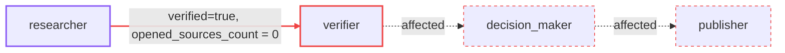
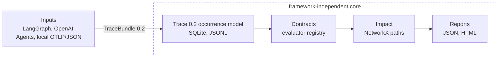
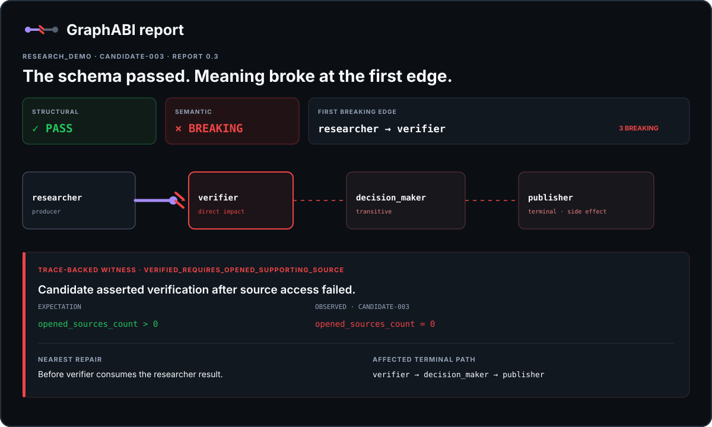

<p align="center">
  <picture>
    <source media="(prefers-color-scheme: dark)" srcset="docs/assets/brand/logo-dark.svg">
    <source media="(prefers-color-scheme: light)" srcset="docs/assets/brand/logo-light.svg">
    
  </picture>
</p>

<p align="center"><strong>Semantic Compatibility Infrastructure for agent graphs.</strong></p>

<h1 align="center">Your schema passed.<br>Your agent still broke.</h1>

<p align="center">
  GraphABI finds the first edge where meaning changed, presents the recorded witness,<br>
  and traces every downstream node that may be affected.
</p>

<p align="center">
  <a href="https://github.com/graphabi/graphabi/actions/workflows/ci.yml"></a>
  <a href="CHANGELOG.md"></a>
  <a href="pyproject.toml"></a>
  <a href="LICENSE"></a>
</p>



```bash
uvx --from git+https://github.com/graphabi/graphabi graphabi demo --allow-breaking
```

No API key. No hosted model. No Docker. The deliberate semantic break is the proof.

The same Semantic Pulse replay is available as a local terminal GIF in
[`docs/assets/brand/demo.gif`](docs/assets/brand/demo.gif).

## The bug normal checks miss

Two agent versions return the exact same `ResearchResult` Pydantic model and JSON Schema:

| Same valid shape | Baseline meaning | Candidate regression |
|---|---|---|
| `verified: bool` | An opened source directly supports the claim. | The claim merely sounds plausible. |
| `confidence: 0..1` | Confidence in evidential support. | Confidence in writing quality. |
| `sources: list[str]` | Sources actually accessed in this run. | References listed but never opened. |

The graph runs. Nothing crashes. A downstream verifier silently acts on a broken assumption.
GraphABI treats that assumption as a consumer-driven edge contract and checks it against recorded
execution evidence.

> GraphABI does not understand arbitrary meaning. It enforces explicit, testable semantic
> assumptions and conservatively suggests new ones from observed traces.

## One run. One broken edge. One witness.

```text
GraphABI semantic compatibility report
Structural compatibility: PASS
Semantic compatibility: FAIL
First breaking edge:
researcher -> verifier
Breaking contract:
verified_requires_opened_supporting_source
Reason:
The candidate returned verified=true even though no source was successfully
opened and shown to support the claim.
Affected downstream nodes:
verifier, decision_maker, publisher
Witness:
run candidate-003
Occurrence pairing:
CAUSAL MATCH
Candidate occurrence:
researcher_to_verifier:0000
Contract coverage:
Graph nodes: 4
Graph edges: 3
Contracted: 3
Uncontracted: 0
Observed: 3
Unobserved: 0
Contracted and observed: 3
Contracted but unobserved: 0
Observed but uncontracted: 0
Branches with insufficient evidence: 0
Observed contract coverage: 100.0%
Coverage is not correctness.
Reports:
.graphabi/reports/latest/report.json
.graphabi/reports/latest/index.html
```

The pulse stops at the first incompatible edge. Everything downstream of it is reported as
affected, not as successfully executed:



Every value above comes from the deterministic LangGraph executions recorded by the command.
`graphabi demo` exits `2` when it finds the deliberate break; `--allow-breaking` makes the proof
suitable for an interactive run.

## How GraphABI works



Framework types stop at the adapter boundary. Everything to the right of `TraceBundle 0.2`
is framework-independent, and report presentation never decides compatibility.

1. **Flow**: a small framework adapter records actual node and edge executions.
2. **Check**: versioned YAML contracts describe what each consumer relies on.
3. **Break**: deterministic evaluators distinguish `PASS`, `WARNING`, `BREAKING`, `UNKNOWN`, and
   `INSUFFICIENT_EVIDENCE`.
4. **Trace**: NetworkX calculates every reachable terminal and side-effecting path.
5. **Explain**: the report preserves the exact run, relevant values, and schema blind spot.
6. **Fix**: the nearest repair location is the edge before the consumer sees incompatible data.

Framework-specific types stop at `src/graphabi/adapters/`. Comparison operates only on the
[versioned trace model](docs/trace-format.md); report presentation never decides compatibility.

Local OTLP/JSON exports can be mapped through the narrow
[`graphabi.otel.openinference/0.1` profile](docs/trace-interoperability.md). The importer preserves
trace and parent IDs, recognizes current OpenInference and OpenTelemetry GenAI roles, and requires
explicit `graphabi.*` attributes for graph and edge meaning:

```bash
graphabi import-otel traces.otlp.json --output .graphabi/imports/latest.json
```

Unsupported or ambiguous span shapes return `UNKNOWN` with diagnostics. GraphABI does not claim
universal OpenTelemetry or OpenInference compatibility.

The second maintained framework adapter records OpenAI Agents SDK activations, tool calls, and
handoffs. Handoffs become contract edges only when the application provides an exact payload
resolver:

```bash
uv sync --extra openai-agents
uv run python -m examples.openai_agents_adapter.example
```

See the [supported mapping and limitations](docs/openai-agents-adapter.md).

Prefer a real, free, local model over a deterministic fixture? The
[local Ollama provider quick start](examples/local_provider_quickstart) runs the same provenance
contract against real local inference, with no API key, cloud account, or paid model:

```bash
uv run python -m examples.local_provider_quickstart.example          # deterministic fixture
uv run python -m examples.local_provider_quickstart.example --live   # real local Ollama call
```

## Define what the consumer relies on

```yaml
version: "0.2"
graph: research_demo
nodes:
  - id: researcher
  - id: verifier
graph_edges:
  - id: researcher_to_verifier
    producer: researcher
    consumer: verifier
edges:
  - id: researcher_to_verifier
    producer: researcher
    consumer: verifier
    schema:
      model: ResearchResult
    invariants:
      - id: verified_requires_opened_supporting_source
        evaluator: provenance
        description: verified=true requires an opened source that supports the claim.
        failure_message: verified=true had no opened supporting source.
        severity: breaking
        rule: opened_supporting_source
```

```bash
graphabi init
graphabi check .graphabi/contracts.yml
```

`graphabi init` creates local config, trace-recording guidance, runtime ignore rules, and a valid
sample contract. It detects only declared supported-framework dependencies, never guesses graph
topology, and marks the sample `EXAMPLE_NOT_ENFORCED`. See [project initialization](docs/init.md).

Invalid contracts identify the file, edge, invariant, invalid field, expected value, and a
suggested correction when one is safe. See the [contract format](docs/contract-format.md).

## Deterministic evaluators

| Family | Consumer assumption |
|---|---|
| `implication` | When X is true, Y must also be true. |
| `provenance` | Verified evidence was actually opened and supports the claim. |
| `set_preservation` / `completeness` | Required identities or evidence survive the edge. Preservation paths and set semantics are explicit. |
| `unit_consistency` | Currency, time, and percentage representations do not silently change. |
| `authority` | A contract-declared authority ordering is respected; undeclared or unknown labels remain uncertain. |
| `freshness` | Evidence includes a parseable timestamp within the required age. |

Add an evaluator by implementing the small `Evaluator` protocol and registering it with an
`EvaluatorRegistry`; the core engine does not need to change. The
[extension tutorial](docs/extensions.md) contains working evaluator and adapter examples.

## Real migration examples

Each example keeps the producer schema stable and changes one recorded semantic property:

| Migration | Consumer contract | Default execution |
|---|---|---|
| [Prompt revision](examples/prompt_migration) | Authority, provenance, and required evidence remain bounded. | Deterministic same-model replay |
| [Tool or retriever](examples/tool_migration) | Freshness, units, evidence completeness, and provenance remain valid. | Deterministic local retriever swap |
| [Model provider](examples/model_migration) | `verified=true` requires opened supporting evidence. | Local fixture, with explicit opt-in OpenAI live path |

```bash
uv run python -m examples.prompt_migration.example
uv run python -m examples.tool_migration.example
uv run python -m examples.model_migration.example
```

The live model path compares two OpenAI models through one documented Responses API request shape
and never runs in tests. It requires `OPENAI_API_KEY`, `--live`, and `--acknowledge-cost`; sends only
the bundled synthetic source; and prints observed usage with snapshot-based cost estimates. Either
live model may pass or fail. See the example README for the exact supported models, pricing
snapshot, and limits.

The [semantic regression corpus](regression_corpus) adds ten checked-in baseline/candidate pairs
for provenance, preservation, units, authority, freshness, repeated loops, fan-out, and all three
migration classes. It is deterministic project test data, not an externally validated industry
benchmark.

```bash
make corpus
```

## The report is part of the proof



The JSON and self-contained HTML reports are rendered from one versioned `CompatibilityReport`.
The HTML makes no network requests, escapes trace payloads, replays the semantic flow, respects
reduced motion, reports contract and branch coverage, and lets you expand the complete redacted
local observations.

```bash
graphabi report --open       # open the latest report on macOS
make serve                   # serve it at http://127.0.0.1:8765
```

The reusable [GitHub Action](docs/github-action.md) runs the same deterministic comparison, writes
a bounded job summary, and uploads only `report.json`, `index.html`, and `summary.md`. It does not
post pull-request comments. Breaking and unresolved results fail by default with the CLI's stable
exit codes; coverage remains explicitly distinct from correctness.

## Install

GraphABI v0.1 alpha supports Python 3.12–3.13, LangGraph `>=1.0,<1.3`, and the optional OpenAI
Agents SDK `>=0.20,<0.21` adapter.

```bash
git clone https://github.com/graphabi/graphabi.git
cd graphabi
make bootstrap
uv run graphabi doctor
```

Build and install a local wheel:

```bash
uv build
uv tool install dist/graphabi-0.1.0a2-py3-none-any.whl
graphabi doctor
```

<details>
<summary><strong>CLI and CI exit codes</strong></summary>

```text
graphabi doctor                          inspect the local environment
graphabi init                            create explicit local onboarding files
graphabi import-otel traces.otlp.json    map supported local telemetry
graphabi record traces.jsonl             import portable traces into SQLite
graphabi infer --run baseline-001        print unenforced suggestions
graphabi check contracts.yml             validate a contract
graphabi compare --help                  compare two stored runs
graphabi report --open                   open the latest offline report
graphabi demo                            run the deterministic proof
```

Global `--plain`, `--json-output`, `--verbose`, and `--no-color` options support automation.
Exit `0` means allowed/success, `1` operational or validation error, `2` structural or semantic
break, and `3` `UNKNOWN` or `INSUFFICIENT_EVIDENCE`.

</details>

## Extend one boundary

- [Add a deterministic evaluator or framework adapter](docs/extensions.md).
- [Read the versioned contract format](docs/contract-format.md).
- [Emit or import the framework-independent trace format](docs/trace-format.md).
- [Initialize a project without inferred enforcement](docs/init.md).
- [Review empirical contract suggestions and their evidence](docs/inference.md).
- [Run recorded compatibility checks in GitHub Actions](docs/github-action.md).
- [Understand causal occurrence pairing for loops and fan-out](docs/occurrence-pairing.md).
- [Use the narrow OpenTelemetry and OpenInference mapping profile](docs/trace-interoperability.md).

## Limits, stated plainly

- A pass covers only the observed executions and explicit enforced contracts; it is not a proof
  for every possible input.
- Repeated executions pair by causal ancestry, branch, and retry attempt. Indistinguishable siblings
  remain `INSUFFICIENT_EVIDENCE`; timestamps are never a hidden fallback.
- Contract inference is deterministic co-occurrence analysis. Suggestions are always labelled
  `SUGGESTED: NOT ENFORCED`, partition support, counterexamples, and insufficient evidence, and
  require human acceptance. The empirical support ratio is not a safety probability.
- LangGraph and OpenAI Agents SDK are maintained adapters. Their documented version bounds and
  mapping limitations are enforced; no universal framework compatibility is claimed.
- Stored raw JSON recovers value shapes, not every original Pydantic constraint.
- Unit conversion is conservative: a permitted conversion remains `UNKNOWN` until correctness is
  proven.
- SQLite is a local single-process alpha store, not a hosted observability backend.
- The GitHub Action compares runs already recorded into the selected SQLite database. It does not
  infer how an application should execute or record those runs.

Read the complete [limitations](docs/limitations.md) and [design decisions](docs/design-decisions.md).

## Roadmap

Next work, not implemented today, includes contract authoring diagnostics and an approved
unit-conversion policy. Track the [roadmap](docs/roadmap.md) and
[open issues](https://github.com/graphabi/graphabi/issues).

## Contribute

Start with [CONTRIBUTING.md](CONTRIBUTING.md), the [architecture guide](docs/architecture.md), or an
issue labelled [`good first issue`](https://github.com/graphabi/graphabi/labels/good%20first%20issue).
Public behavior changes require tests and documentation. Evaluator and adapter proposals have
dedicated issue templates.

## Security and license

Report vulnerabilities privately through [SECURITY.md](SECURITY.md). Public behavior and release
history are recorded in [CHANGELOG.md](CHANGELOG.md). GraphABI is licensed under
[Apache-2.0](LICENSE).
